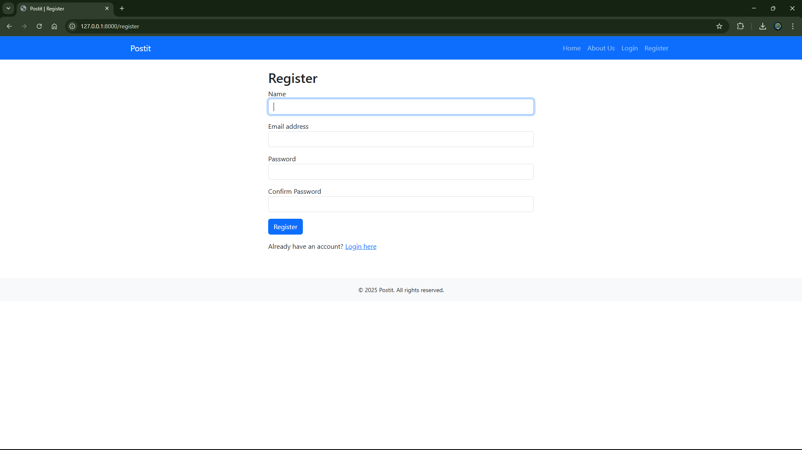
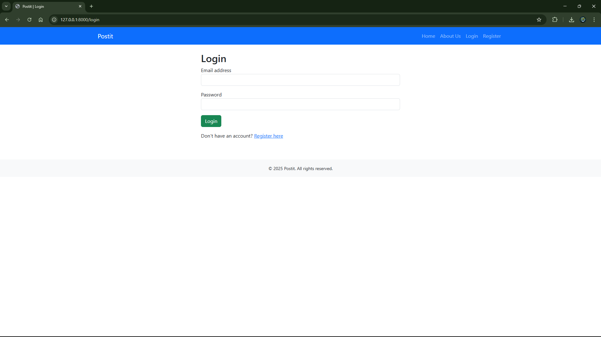
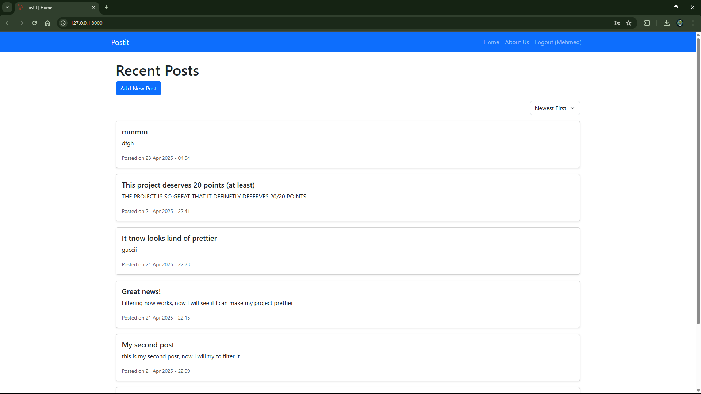
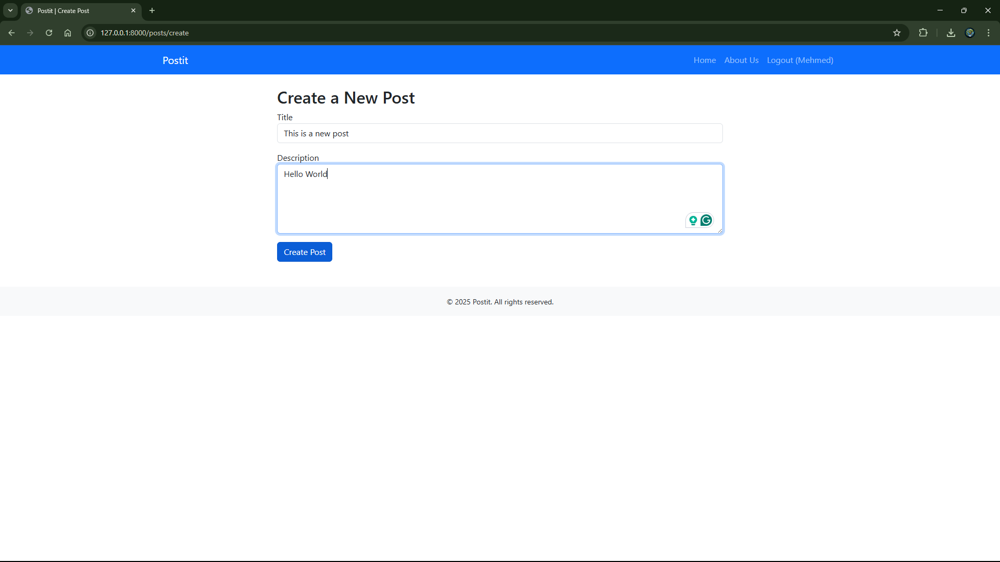
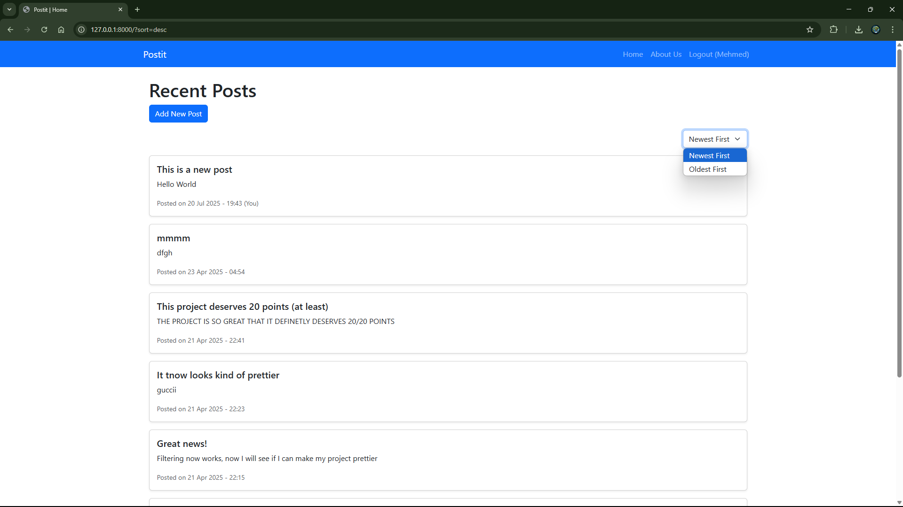
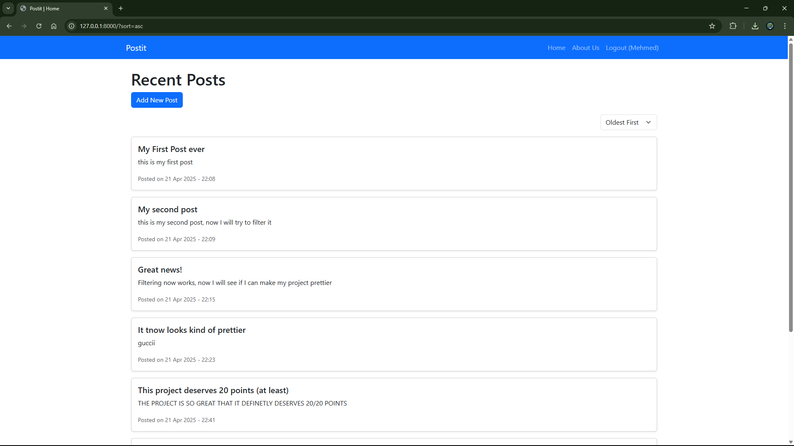
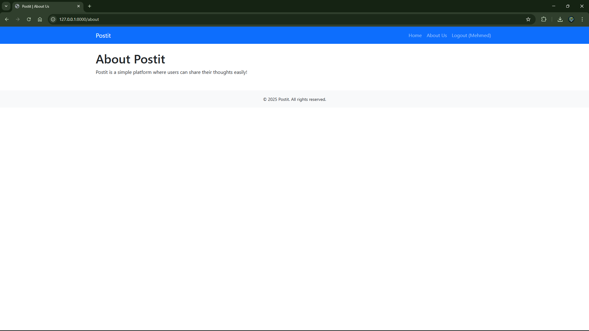
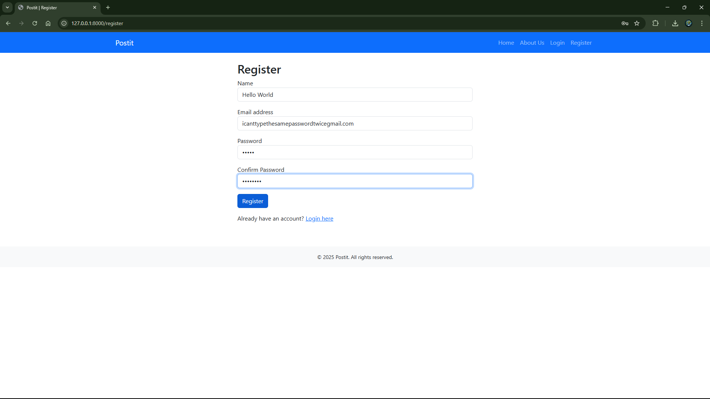
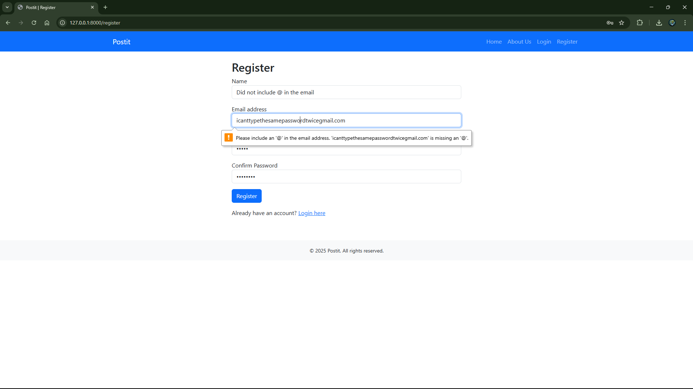

# 📝 Postit Laravel MVC App

A clean and functional blogging-style web app built using **Laravel 10 (MVC)** and **Blade templating**.  
This project was developed as a portfolio piece to demonstrate practical skills in full-stack Laravel development.

---

## 📌 What the Project Does

Postit is a simple but effective platform that allows users to:

- ✅ Register and log in securely  
- ✅ Create text-based blog posts with a title and body  
- ✅ Browse all public posts from other users  
- ✅ View single post details  
- ✅ Restrict post creation to logged-in users only  
- ✅ Log out securely  
- ✅ Navigate pages through a Blade-based UI  

---

## 🌟 Why the Project Is Useful

This project demonstrates a realistic Laravel MVC setup including routing, controllers, views, and user authentication.  
It’s ideal for beginners learning Laravel or for showcasing Laravel fundamentals in a job application.

---

## 🚀 How to Get Started

### ✅ Requirements

- [PHP 8.1+](https://www.php.net/downloads)
- [Composer](https://getcomposer.org/)
- [MySQL](https://www.mysql.com/) or SQLite
- [Node.js + npm](https://nodejs.org/) (for asset building, optional)
- [XAMPP](https://www.apachefriends.org/) (or WAMP/MAMP for a local server environment)
- VS Code or any PHP IDE

### ⚙️ Setup Steps

1. Install and configure XAMPP:
   - Download and install [XAMPP](https://www.apachefriends.org/) for your operating system.
   - Start the Apache and MySQL modules from the XAMPP control panel.
   - Ensure MySQL is running and accessible (e.g., via phpMyAdmin).

2. Clone the repository:
   ```bash
   git clone https://github.com/your-username/postit.git
   cd postit
   ```

3. Install backend dependencies:
   ```bash
   composer install
   ```

4. (Optional) Install frontend dependencies:
   ```bash
   npm install && npm run dev
   ```

5. Copy and configure environment:
   ```bash
   cp .env.example .env
   php artisan key:generate
   ```

6. Update .env database section:
   ```ini
   DB_CONNECTION=mysql
   DB_HOST=127.0.0.1
   DB_PORT=3306
   DB_DATABASE=postit
   DB_USERNAME=root
   DB_PASSWORD=yourpassword
   ```

7. Run the migrations:
   ```bash
   php artisan migrate
   ```

8. Serve the app:
   ```bash
   php artisan serve
   ```

9. Open your browser:
   ```
   http://127.0.0.1:8000
   ```

---

## ❓ Where to Get Help

- Open an issue on this GitHub repo
- Contact me on LinkedIn: Mehmed Mehmedov
- Email: mdxo3@hotmail.com

---

## 👥 Who Maintains This Project

Mehmed Mehmedov  
Informatics & Computer Science Graduate  
GitHub: github.com/mdxo3

---

## 🛠️ Built With

- Laravel 10 (PHP Framework)
- Blade Templating Engine
- Laravel Routing & Controllers
- Eloquent ORM (MySQL or SQLite)
- Bootstrap (optional UI styling)
- Laravel Auth (custom, not Jetstream)

---

## 📸 Demo Preview

Below are screenshots showcasing the Postit app, located in the `Screenshots` folder:

- **Register**: User registration page.  
  
- **Login**: Login interface.  
  
- **Main Page**: Welcome page with links to login/register or view posts.  
  
- **Create Post**: Authenticated users can create new posts.  
  
- **Sorting**: The new post is now visible, and we are going to sort the posts.  
  
- **Sorted from Oldest to Newest**: List of all user-created posts, sorted from oldest to newest.  
  
- **About**: About page.  
  
- **Registering**: Shows the user forgetting to put @ in their email.  
  
- **Failed Register**: The error message that pops up.  
  

---

## 📜 License

This project is licensed under the MIT License — free to use, learn from, and modify.
